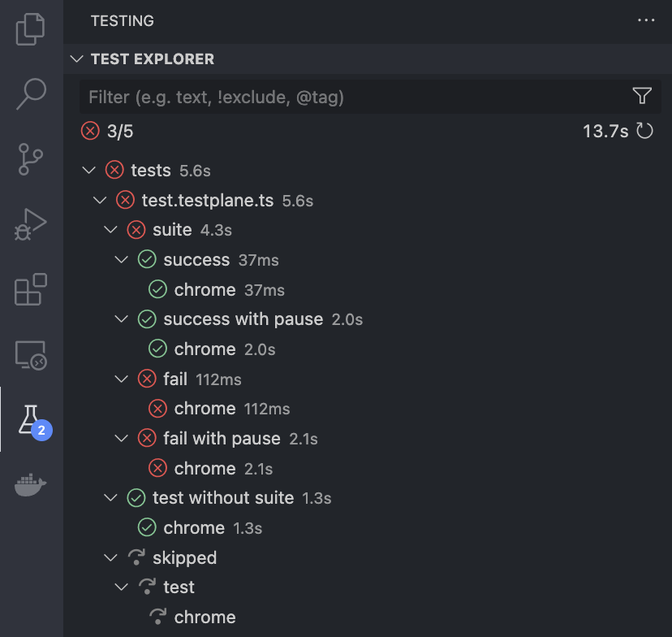
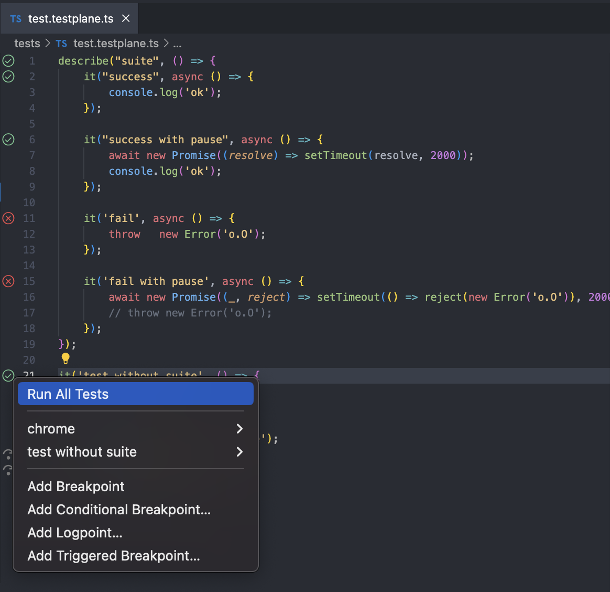

# vscode-testplane

This extension supports [Testplane][testplane] features in VS Code environment.

## Features

- **Run** tests;
- [Install Testplane](#install-testplane);
- [Using the REPL mode](#using-the-repl-mode);

## Requirements

- Visual Studio Code version >= 1.73.0;
- Testplane version >= v8.20.0;
- Node.js version >= 18.0.0 (follows Testplane).

## Usage

You can manage tests from the Testing view and directly within your test files.

### In the Testing View

You can access the extension from the Testing view in the Visual Studio Code sidebar.

The toolbar at the top provides various commands to manage test execution:
- **Run Failed Tests**: to run only failed tests (displayed only if there are failed tests in the run);
- **Refresh Tests**: to reload your tests list, reflecting any new changes;
- **Run All Tests**: to run all tests that are currently visible;
- **Show Output**: to display detailed logs from test executions;
- **Miscellaneous Settings**: to customize the Testing view, such as sorting, grouping, collapse tests or even clear all previous results.

The filter bar allows you to narrow down the tests displayed, focusing on specific tests by name or exclusion patterns.

Icons next to each test indicate their status—passed (checkmark), failed (cross), skipped (arrow), queued (yellow icon), or not executed (dot).

#### 💡 Tips & tricks

- Hovering, or right clicking a folder, test file, test suite, or a test will reveal more actions;
- `Option+Left-click` (on Mac OS) and `Alt+Left-click` (on Windows) on folder makes it possible to quickly expand the entire test tree.

### In the Test File

When viewing a test file, you'll notice test icons in the gutter next to each test case:

- **Run a Single Test:** click the test icon next to a test case to run that specific test in the browsers for which it should run (defined in the config);
- **More Options:** right-click the test icon to open a context menu with additional options:
  - `Run All Tests`: execute the selected test case in the browsers for which it should run (defined in the config);
  - **Test Name** or **Browser Name**: after `Run All Tests` option, the name of the test and the names of the browsers in which it runs are displayed and they have the following options:
    - `Run Test`: execute the selected test case in the browsers for which it should run (defined in the config) if used from **Test Name** and in one specific browser if used from **Browser Name**;
    - `Peek Error`: show the error with which the test fail (displayed only in failed tests);
    - `Reveal in Test Explorer`: locate and highlight the test in the centralized Testing view.
  - `Breakpoint Settings`: set breakpoints to pause execution during debugging. You can add a standard breakpoint, a conditional breakpoint, a logpoint, or a triggered breakpoint.

## Install Testplane

If you are not using testplane yet or starting a new testing project, the "Install Testplane" action from the command panel will help you get started.

## Using the REPL mode

Adds a keybinding (`cmd+shift+8` for mac and `ctrl+shift+8` for others) to run a dedicated section of code in the VSCode terminal. More info about [REPL mode][testplane-repl-mode]. You can overwrite this keybinding in [keyboard shortcuts][vscode-keyboard-shortcuts].

[testplane]: https://testplane.io/
[testplane-repl-mode]: https://github.com/gemini-testing/testplane/blob/master/docs/cli.md#repl-mode
[vscode-keyboard-shortcuts]: https://code.visualstudio.com/docs/getstarted/keybindings

## Configuration

You can configure Testplane using [user and workspace settings](https://code.visualstudio.com/docs/getstarted/settings#_workspace-settings). Available settings:

- `testplane.configPath`: The path to the Testplane [configuration file](https://testplane.io/docs/v8/config/main/).
